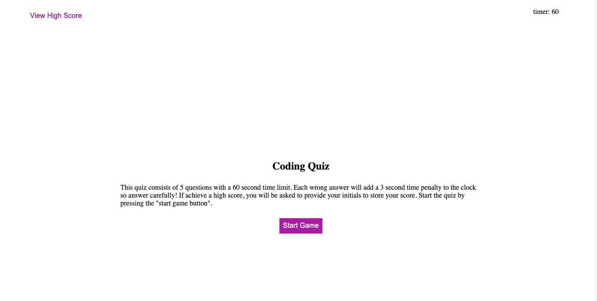
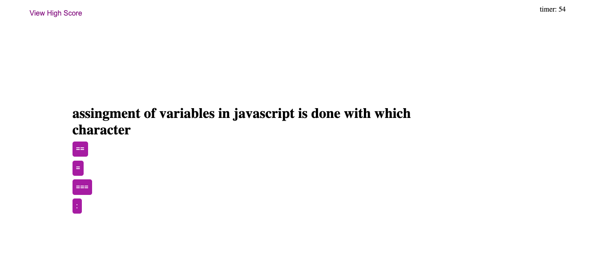

# bootcamp-week4-homework

This repository holds the code for the "University of Sydney Full Stack Flex Coding Bootcamp" Week 4 Homework. The web page is a coding quiz consisting of 5 multiple choice questions surrounding coding in javascript.

The landing page of the website presents a user with a brief explaination of the quiz, the ability to check high scores, and the ability to start the quiz. 
.

The questions are selected randomly out of a library of questions stored in an object 'questionsAndAnswers'. The code checks to the question library against the answered questions array to ensure that no queastions are re asked.

.

There is a 3 second time penalty applied for every wrong answer and the game ends when either there are no more questions left or the timer runs out (0 seconds).

High scores will be stored in local memory and area ccompanied by the players initials which can be viewed by clicking the "View High Score" button on the top left of the page.

The website is is hosted on github pages and can be accessed here: https://evancwoods.github.io/bootcamp-week4-homework//Develop/index.html 

## License
 
The MIT License (MIT)

Copyright (c) 2015 Chris Kibble

Permission is hereby granted, free of charge, to any person obtaining a copy of this software and associated documentation files (the "Software"), to deal in the Software without restriction, including without limitation the rights to use, copy, modify, merge, publish, distribute, sublicense, and/or sell copies of the Software, and to permit persons to whom the Software is furnished to do so, subject to the following conditions:

The above copyright notice and this permission notice shall be included in all copies or substantial portions of the Software.

THE SOFTWARE IS PROVIDED "AS IS", WITHOUT WARRANTY OF ANY KIND, EXPRESS OR IMPLIED, INCLUDING BUT NOT LIMITED TO THE WARRANTIES OF MERCHANTABILITY, FITNESS FOR A PARTICULAR PURPOSE AND NONINFRINGEMENT. IN NO EVENT SHALL THE AUTHORS OR COPYRIGHT HOLDERS BE LIABLE FOR ANY CLAIM, DAMAGES OR OTHER LIABILITY, WHETHER IN AN ACTION OF CONTRACT, TORT OR OTHERWISE, ARISING FROM, OUT OF OR IN CONNECTION WITH THE SOFTWARE OR THE USE OR OTHER DEALINGS IN THE SOFTWARE.
